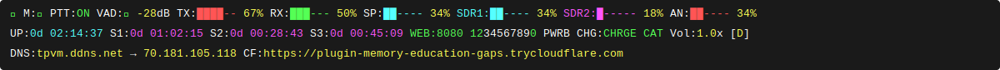
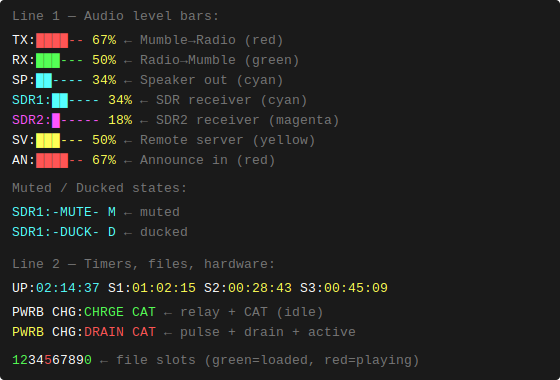

# Mumble Radio Gateway

A bidirectional audio bridge connecting Mumble VoIP to amateur radio with multi-source audio mixing, SDR integration, real-time processing, and extensive features.

```
╔══════════════════════════════════════════════════════════════════════════════════════╗
║                       MUMBLE RADIO GATEWAY — AUDIO FLOW                              ║
╚══════════════════════════════════════════════════════════════════════════════════════╝

  ┌─────────────────┐  PTT audio (direct)                           ┌──────────────────┐
  │  Mumble RX      │──────────────────────────────────────────────►│  Radio TX        │
  │  (Opus VoIP)    │  Mumble users heard → keyed to radio          │  AIOC USB        │
  └─────────────────┘  auto-PTT, bypasses mixer                     │  GPIO PTT        │
                                                                     │                  │
  SOURCES                                  MIXER                    │  ↑ also receives ┤
  ───────                       ╔══════════════════════╗            │  File Playback   │
                                ║                      ║            └──────────────────┘
  ┌─────────────────┐           ║                      ║   PTT audio        ▲
  │  File Playback  │──────────►║   P R I O R I T Y    ╠────────────────────┘
  │  Priority 0     │           ║      M I X E R       ║
  │  WAV·MP3·FLAC   │           ║                      ║  Radio RX  ┌──────────────────┐
  │  10 slots (0–9) │           ║  Priority-based      ╠───────────►│  Mumble TX       │
  └─────────────────┘           ║  source selection    ║            │  Opus VoIP       │
                                ║                      ║            └──────────────────┘
  ┌─────────────────┐           ║  SDR ducking:        ║
  │  Radio RX (P1)  │──────────►║  Radio RX            ║  Mixed     ┌──────────────────┐
  │  AIOC USB       │           ║    > SDR1 (P1)       ╠───────────►│  Stream Output   │
  └─────────────────┘           ║      > SDR2 (P2)     ║            │  Darkice /       │
                                ║      > SDRSV (P3)    ║            │  Broadcastify    │
  ┌─────────────────┐           ║                      ║            └──────────────────┘
  │  SDR1 (P2)      │──────────►║  Attack/Release/     ║
  │  ALSA Loopback  │  [DUCK]   ║  Padding transitions ║  EchoLink  ┌──────────────────┐
  │  ■ cyan bar     │           ║                      ╠───────────►│  EchoLink TX     │
  └─────────────────┘           ║  Audio Processing:   ║            │  Named Pipes     │
                                ║  VAD · Noise Gate    ║            └──────────────────┘
  ┌─────────────────┐           ║  AGC · HPF           ║
  │  SDR2 (P2)      │──────────►║  Wiener · Echo Canc  ║  TCP out   ┌──────────────────┐
  │  ALSA Loopback  │  [DUCK]   ║                      ╠───────────►│  Remote Client   │
  │  ■ magenta bar  │           ╚══════════════════════╝            │  (role=client)   │
  └─────────────────┘                                               │  SV:[yellow bar] │
                                Duck priority:                      └──────────────────┘
  ┌─────────────────┐             Radio RX > SDR1 (P1) > SDR2 (P2) > SDRSV (P3)
  │  SDRSV (P3)     │──────────►
  │  Remote Audio   │  [DUCK]   Each duck transition uses attack / release / padding:
  │  TCP (role=cl.) │  ■ green    [source active] → silence gap → [audio switches]
  └─────────────────┘             [source silent ] → silence gap → [audio restores]

  ┌─────────────────┐
  │  EchoLink (P4)  │──────────►
  │  Named Pipes    │
  └─────────────────┘
```

## Table of Contents

- [Features](#features)
- [Quick Start](#quick-start)
- [SDR Integration](#sdr-integration)
- [Remote Audio Link](#remote-audio-link)
- [Keyboard Controls](#keyboard-controls)
- [Status Bar](#status-bar)
- [Architecture](#architecture)
- [Configuration Reference](#configuration-reference)
- [Troubleshooting](#troubleshooting)
- [Advanced Features](#advanced-features)

## Features

### Core Functionality
- **Bidirectional Audio Bridge**: Seamless communication between Mumble VoIP and radio
- **Multi-Source Audio Mixing**: Simultaneous mixing of 5 audio sources with priority control
- **Auto-PTT Control**: Automatic push-to-talk with configurable delays and tail
- **Voice Activity Detection (VAD)**: Smart audio gate prevents noise transmission (enabled by default)
- **Real-Time Audio Processing**: Noise gate, AGC, filters, echo cancellation
- **Live Status Display**: Real-time bars showing TX/RX/SDR levels with color coding

### Audio Sources (Priority-Based Mixing)

```
Priority 0 (Highest) → File Playback    [PTT → Radio TX]
Priority 1           → Mumble RX        [PTT → Radio TX, direct path]
Priority 1           → Radio RX         [→ Mumble TX, no PTT]
Priority 2           → SDR1 Receiver    [→ Mumble TX, with ducking]
Priority 2           → SDR2 Receiver    [→ Mumble TX, with ducking]
Priority 3 (default) → SDRSV            [→ Mumble TX, Remote Audio Link client]
Priority 4 (Lowest)  → EchoLink        [→ Mumble TX]
```

#### 1. **File Playback** (Priority 0, PTT enabled)
   - 10 announcement slots (keys 1-9 + Station ID on 0)
   - WAV, MP3, FLAC support with automatic resampling
   - Volume normalization and per-file controls
   - **Triggers PTT** when playing; Radio RX still forwarded to Mumble

#### 2. **Radio RX** (Priority 1)
   - AIOC USB audio interface
   - GPIO PTT control
   - Automatic audio processing pipeline
   - Independent mute control

#### 3. **SDR1 Receiver** (Priority 2, with ducking)
   - ALSA loopback device input
   - Independent volume, mute, and duck controls
   - Real-time level display (cyan bar)
   - Ducked by Radio RX and higher-priority SDR

#### 4. **SDR2 Receiver** (Priority 2, with ducking)
   - Second independent ALSA loopback input
   - Same controls as SDR1 but independent (`x` to mute)
   - Real-time level display (magenta bar)
   - Priority-based ducking vs SDR1 (configurable)

#### 5. **Mumble RX** (Priority 1, PTT enabled — direct path)
   - Audio from Mumble users is captured via a callback, **bypassing the mixer**
   - Immediately keys PTT and transmits through the AIOC to the radio
   - Output volume controlled by `OUTPUT_VOLUME`
   - Suppressed when TX is muted (`t` key) or manual PTT mode is active
   - This is the primary gateway path: **Mumble users speak → radio transmits**

#### 6. **Remote Audio Link / SDRSV** (Priority 3, configurable)
   - Links two gateway instances over TCP — one sends, one receives
   - **Server** (`role=server`): dials out to the client and streams mixed audio (radio RX + SDR)
   - **Client** (`role=client`): listens for the server, receives audio as source "SDRSV" into the mixer
   - Participates fully in the duck/priority system — configurable priority vs SDR1/SDR2
   - Status bar: server shows `SV:[yellow]`, client shows `CL:[green]`
   - `c` key mutes/unmutes SDRSV on the client

#### 7. **EchoLink** (Priority 4)
   - Named pipe integration
   - TheLinkBox compatible
   - Optional routing to/from Mumble and Radio

### SDR Audio Ducking

The SDR source features **audio ducking** to prevent interference with primary communications:

**Ducking Enabled (default):**
```
┌─────────────────────────────────────────┐
│ Radio RX active                         │
│ ├─ Radio audio → Mumble ✓              │
│ └─ SDR audio   → DUCKED (silenced)     │
└─────────────────────────────────────────┘

┌─────────────────────────────────────────┐
│ No other audio active                   │
│ └─ SDR audio   → Mumble ✓              │
└─────────────────────────────────────────┘
```

**Ducking Disabled (mixing mode):**
```
┌─────────────────────────────────────────┐
│ Radio RX + SDR both active              │
│ ├─ Radio audio → Mumble (50% mix)      │
│ └─ SDR audio   → Mumble (50% mix)      │
└─────────────────────────────────────────┘
```

**Controls:**
- Press `d` to toggle SDR1 ducking on/off at runtime
- Config: `SDR_DUCK = true` / `SDR2_DUCK = true` (default)
- Status indicator: `[D]` flag when SDR1 ducking enabled

### Dual SDR with Priority Ducking

Two SDR inputs can run simultaneously with configurable priority:

```
┌──────────────────────────────────────────────────────────────┐
│  PRIORITY HIERARCHY                                          │
│                                                              │
│  1. Radio RX (AIOC)  ← always top priority, ducks all SDRs  │
│  2. SDR1 (priority=1) ← ducks SDR2 only when SDR1 has signal │
│  3. SDR2 (priority=2) ← lowest, ducked by SDR1 and radio    │
└──────────────────────────────────────────────────────────────┘
```

**Example use cases:**
- **Scanner + web SDR**: SDR1 = local scanner (priority 1), SDR2 = websdr.org feed (priority 2) — scanner ducks the web SDR when active
- **Two frequencies**: Monitor VHF and UHF simultaneously; higher-priority channel interrupts the other
- **Remote + local**: Local SDR1 takes priority over a remote SDR2 pipe

**Configuration:**
```ini
ENABLE_SDR  = true      # SDR1 enabled
ENABLE_SDR2 = true      # SDR2 enabled

SDR_PRIORITY  = 1       # SDR1: higher priority (ducks SDR2)
SDR2_PRIORITY = 2       # SDR2: lower priority (ducked by SDR1)

SDR_DUCK  = true        # SDR1: ducked by radio RX
SDR2_DUCK = true        # SDR2: ducked by radio RX and SDR1
```

**Status bar during dual SDR operation:**
```
SDR1:[███---] 45%  SDR2:-DUCK- D      ← SDR2 ducked by SDR1
SDR1:-DUCK- D      SDR2:-DUCK- D      ← both ducked by radio RX
SDR1:[███---] 45%  SDR2:[██----] 30%  ← both playing (mixed)
```
*(The bar is always 6 characters wide; `-DUCK-` and `-MUTE-` replace the filled bar in their respective states.)*

### Source Switching — Attack, Release & Transition Padding

SDR ducking transitions use a three-stage gate to avoid jarring cuts.
**Note:** These timers apply only to SDR ducking (Radio RX signal detection).
File playback is deterministic — PTT fires immediately when a file starts,
with no attack delay, and the `PTT_ANNOUNCEMENT_DELAY` window handles key-up timing separately.

```
┌──────────────────────────────────────────────────────────┐
│  ATTACK: radio signal must be CONTINUOUSLY present for   │
│  SIGNAL_ATTACK_TIME before the SDR is ducked.            │
│  Any silence resets the timer — transient noise can      │
│  never trigger a duck.                                   │
├──────────────────────────────────────────────────────────┤
│  TRANSITION (duck-out):                                  │
│  [SDR playing] → [silence gap] → [radio takes over]     │
│                   SWITCH_PADDING_TIME                    │
├──────────────────────────────────────────────────────────┤
│  RELEASE: radio must be continuously silent for          │
│  SIGNAL_RELEASE_TIME before the SDR resumes.             │
│  Brief pauses in speech don't un-duck prematurely.       │
├──────────────────────────────────────────────────────────┤
│  TRANSITION (duck-in):                                   │
│  [radio ends] → [silence gap] → [SDR resumes]           │
│                 SWITCH_PADDING_TIME                      │
└──────────────────────────────────────────────────────────┘
```

**Configuration:**
```ini
SIGNAL_ATTACK_TIME  = 0.5   # seconds of continuous signal before duck
SIGNAL_RELEASE_TIME = 2.0   # seconds of silence before SDR resumes
SWITCH_PADDING_TIME = 1.0   # silence gap inserted at each transition
```

### Text-to-Speech
- Google TTS (gTTS) integration
- Mumble text command: `!speak <text>`
- Automatic MP3 generation
- Format validation (detects API errors)
- Rate limiting detection
- Volume boost control (default: 1.0x)

### Audio Processing
- **VAD**: Voice Activity Detection with configurable threshold (enabled by default)
- **Noise Gate**: Removes background noise
- **AGC**: Automatic Gain Control for consistent levels
- **HPF**: High-pass filter (removes low-frequency rumble)
- **Spectral/Wiener Filter**: Advanced noise suppression
- **Echo Cancellation**: Reduces feedback

### Streaming
- **Darkice Integration**: Stream to Icecast server
- **Broadcastify Support**: Live scanner feed
- Mixed audio output via named pipe
- Configurable bitrate and format

### Speaker Output (Local Monitoring)
- Mirrors the mixed audio output to a local speaker/headphone device in real-time
- The `SP:[bar]` reflects the actual audio being sent to the speaker (mixed RX + SDR + PTT), not just the AIOC RX level — so the bar stays live regardless of RX mute state
- Configurable device (by name, index, or empty for system default)
- Independent mute toggle (`o` key) — does not affect Mumble or streaming
- Volume control via `SPEAKER_VOLUME`
- Status bar shows `SP:[bar]` level when enabled; decays to 0 when no audio is playing
- WirePlumber exclusion automatically applied for USB audio devices (e.g. C-Media)

## Quick Start

### Requirements
- Raspberry Pi 4 (or similar Linux system)
- Python 3.7+
- AIOC USB audio interface
- Mumble server access

### Installation

```bash
# Clone repository
git clone <your-repo-url>
cd mumble-radio-gateway

# Run the installer (handles all dependencies automatically)
bash scripts/install.sh
```

The installer handles:
- System packages (Python, PortAudio, FFmpeg, HIDAPI, etc.)
- ALSA loopback module (`snd-aloop`) pinned to `hw:4`, `hw:5`, `hw:6`
- Python packages (`hid`, `numpy`, `pyaudio`, `soundfile`, `resampy`, `psutil`, `gtts`, `pymumble-py3`)
- UDEV rules for AIOC USB audio + HID (PTT control)
- Audio group membership and realtime scheduling limits
- Darkice + WirePlumber configuration (if applicable)
- Example `gateway_config.txt`

> **Supported platforms:** Raspberry Pi (any model), Debian 12, Ubuntu 22.04+, any Debian-based Linux.

> **Python 3.12+ note:** The installer patches the `pymumble` SSL layer automatically. No manual fix required.

**Manual installation (alternative):**

```bash
sudo apt-get install -y python3 python3-pip portaudio19-dev libsndfile1 \
    libhidapi-libusb0 libhidapi-dev ffmpeg
# Install Python packages (pymumble-py3 preferred; falls back to pymumble)
pip3 install pymumble-py3 hid pyaudio soundfile resampy gtts psutil --break-system-packages
```

### Basic Configuration

Edit `gateway_config.txt`:

```ini
# Mumble Server
MUMBLE_SERVER = your.mumble.server
MUMBLE_PORT = 64738
MUMBLE_USERNAME = RadioGateway
MUMBLE_PASSWORD = yourpassword

# Radio Interface (AIOC)
AIOC_INPUT_DEVICE =    # Auto-detected
AIOC_OUTPUT_DEVICE =   # Auto-detected
AIOC_PTT_CHANNEL = 3

# Enable features (these are the defaults)
ENABLE_VAD = true      # Voice Activity Detection
ENABLE_TTS = true      # Text-to-Speech
ENABLE_SDR = true      # SDR1 receiver
SDR_DUCK = true        # SDR1 ducking (silence when higher priority audio active)

# Optional second SDR receiver
ENABLE_SDR2 = false    # SDR2 disabled by default
SDR2_DEVICE_NAME = hw:5,1
SDR2_PRIORITY = 2      # Ducked by SDR1 and radio RX

# Optional local speaker monitoring (press 'o' to toggle mute at runtime)
ENABLE_SPEAKER_OUTPUT = false
SPEAKER_OUTPUT_DEVICE =    # Empty = system default; or device name/index
SPEAKER_VOLUME = 1.0
```

## SDR Integration

### Setup ALSA Loopback

SDR audio uses ALSA loopback devices for piping audio from SDR software (like SDRconnect) into the gateway.

```bash
# Load loopback module (pinned to hw:4, hw:5, hw:6)
sudo modprobe snd-aloop enable=1,1,1 index=4,5,6

# Make permanent
echo "options snd-aloop enable=1,1,1 index=4,5,6" | sudo tee /etc/modprobe.d/snd-aloop.conf
echo "snd-aloop" | sudo tee -a /etc/modules

# Verify
aplay -l | grep Loopback
```

> The installer (`scripts/install.sh`) does all of this automatically.

### Loopback Device Pairing

ALSA loopback devices work in **pairs**. For dual SDR you need two separate loopback card numbers:

```
┌──────────────────────────────────────────────┐
│  ALSA Loopback Device Pairing                │
├──────────────────────────────────────────────┤
│  hw:X,0 (playback) ↔ hw:X,1 (capture)       │
│                                              │
│  SDR1 software → hw:4,0                     │
│  Gateway SDR1  ← hw:4,1                     │
│                                              │
│  SDR2 software → hw:5,0  (different card)   │
│  Gateway SDR2  ← hw:5,1                     │
│                                              │
│  (installer pins loopback cards to hw:4,5,6) │
└──────────────────────────────────────────────┘
```

To get three loopback cards pinned to fixed device numbers, use `enable=1,1,1 index=4,5,6`:
```bash
# Write config first so the setting survives reboots
echo "options snd-aloop enable=1,1,1 index=4,5,6" | sudo tee /etc/modprobe.d/snd-aloop.conf
echo "snd-aloop" | sudo tee -a /etc/modules

# Stop audio services that may hold the module, then reload
sudo systemctl stop pipewire wireplumber pulseaudio 2>/dev/null || true
sudo modprobe -r snd-aloop 2>/dev/null; sudo modprobe snd-aloop enable=1,1,1 index=4,5,6
```

> **Note:** `numlids=N` is a Raspberry Pi-only kernel parameter and is silently ignored on standard Debian/Ubuntu. Use `enable=1,1,1` instead — it works on all platforms.

> **Pinned card numbers:** `index=4,5,6` ensures the loopback cards always appear at `hw:4`, `hw:5`, `hw:6` regardless of how many other audio cards are present. The installer applies this automatically.

### Configuration

```ini
# SDR1 (cyan bar)
ENABLE_SDR = true
SDR_DEVICE_NAME = hw:4,1   # Loopback capture side (installer pins card 1 to hw:4)
SDR_PRIORITY = 1           # Higher priority (ducks SDR2)
SDR_DUCK = true            # Ducked by radio RX
SDR_MIX_RATIO = 1.0
SDR_DISPLAY_GAIN = 1.0
SDR_AUDIO_BOOST = 1.0
SDR_BUFFER_MULTIPLIER = 8

# SDR2 (magenta bar) — disabled by default
ENABLE_SDR2 = false
SDR2_DEVICE_NAME = hw:5,1  # Loopback capture side (installer pins card 2 to hw:5)
SDR2_PRIORITY = 2          # Lower priority (ducked by SDR1)
SDR2_DUCK = true           # Ducked by radio RX and SDR1
SDR2_MIX_RATIO = 1.0
SDR2_DISPLAY_GAIN = 1.0
SDR2_AUDIO_BOOST = 1.0
SDR2_BUFFER_MULTIPLIER = 8
```

### Testing SDR Audio

```bash
# Test SDR input
python3 test_sdr_loopback.py

# Test loopback pairing
python3 test_loopback_bidirectional.py
```

## Keyboard Controls

Press keys during operation to control the gateway:

### Mute Controls
- `t` = TX Mute (Mumble → Radio)
- `r` = RX Mute (Radio → Mumble)
- `s` = SDR1 Mute
- `x` = SDR2 Mute
- `c` = Remote Audio Mute (SDRSV — client mode only)
- `m` = Global Mute (mutes all audio)
- `o` = Toggle Speaker Output Mute

### SDR Controls
- `d` = **Toggle SDR1 Ducking** (duck vs. mix mode)
- `s` = Toggle SDR1 Mute
- `x` = Toggle SDR2 Mute

### Audio Controls
- `v` = Toggle VAD on/off
- `,` = Volume Down (Radio → Mumble)
- `.` = Volume Up (Radio → Mumble)
- `p` = Manual PTT Toggle (override auto-PTT)

### Processing Controls
- `n` = Toggle Noise Gate
- `f` = Toggle High-Pass Filter
- `a` = Toggle AGC
- `w` = Toggle Wiener Filter (spectral noise suppression)
- `e` = Toggle Echo Cancellation

### File Playback Controls
- `1-9` = Play announcement files
- `0` = Play Station ID
- `-` = Stop playback

## Status Bar



### Status Indicators

| Indicator | Meaning |
|-----------|---------|
| **ACTIVE/IDLE/STOP** | Audio capture status (✓/⚠/✗) |
| **M:✓/✗** | Mumble connected/disconnected |
| **PTT:ON/--** | Push-to-talk active/inactive |
| **PTT:M-ON** | Manual PTT mode active |
| **VAD:✗** | VAD disabled (red X) |
| **VAD:🔊** | VAD active (green speaker) |
| **VAD:--** | VAD silent (gray) |
| **-48dB** | Current VAD level (when enabled) |

### Audio Level Bars

Bars appear in this order: TX → RX → SP → SDR1 → SDR2 → SV or CL

| Bar | Color | Meaning |
|-----|-------|---------|
| **TX:[bar]** | Red | Mumble → Radio (radio TX) |
| **RX:[bar]** | Green | Radio → Mumble (radio RX) |
| **SP:[bar]** | Cyan | Speaker output audio level — tracks actual mixed output, not just radio RX (if enabled) |
| **SDR1:[bar]** | Cyan | SDR1 receiver audio level |
| **SDR2:[bar]** | Magenta | SDR2 receiver audio level (if enabled) |
| **SV:[bar]** | Yellow | Remote Audio Link — server mode: audio level being sent to remote client |
| **CL:[bar]** | Green | Remote Audio Link — client mode: audio level received from remote server (SDRSV) |

**Bar States:**



**All bars have fixed width** (11 visible characters: 6-char bar + space + 4-char suffix) to prevent line length changes.

### File Status (0-9)
- **Green number** = File loaded
- **Red number** = File currently playing
- **White number** = No file assigned

### Processing Flags

Flags appear in yellow brackets at the end: `[N,F,A,D]`

| Flag | Meaning |
|------|---------|
| **N** | Noise Gate enabled |
| **F** | High-Pass Filter enabled |
| **A** | AGC enabled |
| **W** | Wiener Filter enabled |
| **S** | Spectral Suppression enabled |
| **E** | Echo Cancellation enabled |
| **D** | SDR Ducking enabled |
| **X** | Stream Health DISABLED |

### Diagnostics

| Indicator | Meaning |
|-----------|---------|
| **Vol:1.0x** | RX volume multiplier |
| **R:5** | Stream restart count (only if >0) |
| **S:2** | DarkIce restart count (only if >0) |
| **W2** | SDR watchdog recovery count (only if >0; appended directly after SDR bar, no colon) |

## Audio Level Calculation

All bars (TX, RX, SDR) use the same RMS calculation method:

```python
# Calculate RMS (Root Mean Square)
RMS = sqrt(sum(samples²) / count)

# Convert to dB
dB = 20 * log10(RMS / 32767)

# Map -60dB to 0dB → 0-100%
Level = (dB + 60) * (100/60)
```

**Smoothing:**
- **Fast attack**: Immediate response on level increase
- **Slow decay**: `new_level = old * 0.7 + current * 0.3`

This creates responsive bars that show peaks immediately but decay smoothly.

## Architecture

### Audio Flow Diagram

```
┌──────────────────────────────────────────────────────────────────┐
│                         AUDIO INPUTS                              │
├──────────────────────────────────────────────────────────────────┤
│  Priority 0:  File Playback (10 slots) ───────┐                  │
│  Priority 1:  Radio RX (AIOC)         ────────┼──→ MIXER         │
│  Priority 2:  SDR (ALSA Loopback)     ────────┤                  │
│  Priority 3:  EchoLink (Named Pipes)  ────────┘                  │
│                                                                   │
│  Mumble RX  ──────────────────────────────────→ Radio TX (PTT)   │
│             (direct callback path, bypasses mixer entirely)       │
└──────────────────────────────────────────────────────────────────┘
                                                  │
                                                  ↓
┌──────────────────────────────────────────────────────────────────┐
│                      AUDIO PROCESSING                             │
├──────────────────────────────────────────────────────────────────┤
│  • Voice Activity Detection (VAD)                                │
│  • Noise Gate / Spectral Suppression                             │
│  • High-Pass Filter (HPF)                                        │
│  • Automatic Gain Control (AGC)                                  │
│  • Echo Cancellation                                              │
└──────────────────────────────────────────────────────────────────┘
                                                  │
                                                  ↓
┌──────────────────────────────────────────────────────────────────┐
│                        AUDIO OUTPUTS                              │
├──────────────────────────────────────────────────────────────────┤
│  ├─→ Radio TX (AIOC + Auto-PTT)                                  │
│  ├─→ Mumble TX                                                    │
│  ├─→ Darkice Stream (Icecast/Broadcastify)                       │
│  ├─→ Speaker Output (local monitoring, optional)                 │
│  └─→ EchoLink TX (if enabled)                                    │
└──────────────────────────────────────────────────────────────────┘
```

### Priority System

When multiple sources provide audio simultaneously:

```
Mumble RX (direct path — bypasses mixer):
  ├─ Audio captured via callback, PTT keyed immediately
  ├─ Written directly to AIOC output → Radio TX
  └─ Suppressed only when TX muted or manual PTT mode active

Priority 0 (File Playback):
  ├─ Triggers PTT → announcement sent to Radio TX
  ├─ Concurrent Radio RX still forwarded to Mumble
  └─ Highest priority within mixer

Priority 1 (Radio RX / AIOC):
  ├─ Radio RX → Mumble TX (and stream if enabled)
  └─ Forwarded to all listeners

Priority 2 (SDR):
  ├─ DUCKED when Priority 0 or 1 active (default)
  ├─ OR mixed at SDR_MIX_RATIO (if ducking disabled)
  └─ Goes to Mumble TX only

Priority 3 (EchoLink):
  └─ Lowest priority
```

### SDR Ducking Logic

```
┌─────────────────────────────────────────────────────────────┐
│              SDR Ducking Decision Tree (per SDR)             │
└─────────────────────────────────────────────────────────────┘

Is this SDR enabled?
  └─ NO  → not in mix
  └─ YES ↓

Is this SDR muted (s/x key)?
  └─ YES → stream drained silently, not in mix
  └─ NO  ↓

Is SDR ducking enabled (SDR_DUCK / SDR2_DUCK)?
  └─ NO  → always mixed at SDR_MIX_RATIO
  └─ YES ↓

Is Radio RX (AIOC) active? [after attack/release/padding]
  └─ YES → ducked
  └─ NO  ↓

Is a higher-priority SDR active (lower priority number)?
  └─ YES → ducked
  └─ NO  → passes through normally
```

Both SDRs go through the same pipeline independently, so SDR1 can be playing while SDR2 is ducked, or vice versa.

### SDR Loopback Watchdog

After extended runtime, the `snd-aloop` kernel module can get stuck — reads block forever or throw `IOError` on every attempt. The watchdog detects this and recovers automatically.

**Recovery stages** (tried in order until one succeeds):

| Stage | Action | Notes |
|-------|--------|-------|
| 1 | Reopen ALSA stream | 200ms settle time |
| 2 | Reinitialize PyAudio entirely | 500ms settle time |
| 3 | Reload `snd-aloop` kernel module | Requires `SDR_WATCHDOG_MODPROBE = true` + sudoers entry |

**Configuration:**
```ini
SDR_WATCHDOG_TIMEOUT     = 10      # seconds with no successful read → recovery
SDR_WATCHDOG_MAX_RESTARTS = 5      # give up after this many total attempts
SDR_WATCHDOG_MODPROBE    = false   # enable stage 3 (kernel module reload)

# Same settings for SDR2 with SDR2_ prefix
SDR2_WATCHDOG_TIMEOUT     = 10
SDR2_WATCHDOG_MAX_RESTARTS = 5
SDR2_WATCHDOG_MODPROBE    = false
```

**Stage 3 sudoers setup** (only needed if `SDR_WATCHDOG_MODPROBE = true`):
```bash
# Add to /etc/sudoers.d/gateway-loopback (use visudo)
<user> ALL=(ALL) NOPASSWD: /sbin/modprobe -r snd-aloop, /sbin/modprobe snd-aloop
```

**Status bar:** `W<N>` appears after the SDR bar when N watchdog recoveries have occurred. If all stages fail and `MAX_RESTARTS` is reached, the SDR goes silent — use `!restart` or Ctrl+C to recover manually.

## Remote Audio Link

The Remote Audio Link connects two gateway instances over TCP so one machine's audio feeds into the other's mixer. This is useful for:

- **Primary + secondary gateway**: Primary has AIOC + radio + Mumble. Secondary has only SDR or no radio. Secondary (client) receives the primary's radio RX as a mixer source alongside its own SDR.
- **Remote monitoring**: Listen to a gateway's radio RX on any machine on the LAN/VPN without needing a full Mumble setup.
- **Multi-site relay**: Two gateways at different sites; one sends its mixed audio to the other for rebroadcast.

### Connection Model

```
  SERVER machine                              CLIENT machine
  REMOTE_AUDIO_ROLE = server                  REMOTE_AUDIO_ROLE = client
  REMOTE_AUDIO_HOST = <client IP>             REMOTE_AUDIO_HOST = '' (all interfaces)
  REMOTE_AUDIO_PORT = 9600                    REMOTE_AUDIO_PORT = 9600

  ┌────────────────────────────┐              ┌────────────────────────────┐
  │  Radio RX (AIOC)           │              │  Local SDR1/SDR2           │
  │  SDR mix                   │              │                            │
  │  File playback             │    TCP       │  SDRSV source (remote)     │
  │                            │  ─────────► │  feeds into local mixer    │
  │  RemoteAudioServer         │  port 9600   │  RemoteAudioSource         │
  │  SV:[yellow bar]           │              │  CL:[green bar]            │
  │                            │              │  'c' to mute/unmute        │
  └────────────────────────────┘              └────────────────────────────┘

  Server dials OUT to client.  Client listens for inbound connection.
  Audio flows one way only: server → client.
  Server auto-reconnects every REMOTE_AUDIO_RECONNECT_INTERVAL seconds if link drops.
```

> **Note:** The naming is from the audio perspective. The "server" is the audio *source* (it initiates the TCP connection and pushes audio). The "client" is the audio *sink* (it accepts the connection and receives audio into its mixer). This is the reverse of a typical client-server model.

### Priority and Ducking on the Client

The SDRSV source participates in the duck system with `REMOTE_AUDIO_PRIORITY` controlling its rank:

```
Default (REMOTE_AUDIO_PRIORITY = 3):
  Radio RX > SDR1 (P=1) > SDR2 (P=2) > SDRSV (P=3)
  → SDRSV is ducked by radio RX, SDR1, and SDR2

To let SDRSV take priority over SDR1/SDR2 (REMOTE_AUDIO_PRIORITY = 0):
  Radio RX > SDRSV (P=0) > SDR1 (P=1) > SDR2 (P=2)
  → SDRSV ducks the local SDRs when it has audio
```

`REMOTE_AUDIO_DUCK = true` (default) means SDRSV is silenced when any higher-priority source is active.
Set `REMOTE_AUDIO_DUCK = false` to always mix SDRSV at full volume regardless of other sources.

### Configuration

```ini
# ── Server machine (sends audio) ─────────────────────
REMOTE_AUDIO_ROLE = server
REMOTE_AUDIO_HOST = 192.168.1.50  # IP of the client machine
REMOTE_AUDIO_PORT = 9600

# ── Client machine (receives audio into mixer) ────────
REMOTE_AUDIO_ROLE = client
REMOTE_AUDIO_HOST =               # Leave blank to listen on all interfaces
REMOTE_AUDIO_PORT = 9600
REMOTE_AUDIO_DUCK = true          # Duck SDRSV when higher-priority sources are active
REMOTE_AUDIO_PRIORITY = 3         # sdr_priority (0=highest; ducks SDR1/SDR2 if < their priority)
REMOTE_AUDIO_DISPLAY_GAIN = 1.0   # Status bar sensitivity
REMOTE_AUDIO_AUDIO_BOOST = 1.0    # Volume boost for received audio
REMOTE_AUDIO_RECONNECT_INTERVAL = 5.0  # Seconds between reconnect attempts (server only)
```

### Firewall

The client machine must accept inbound TCP on `REMOTE_AUDIO_PORT` (default 9600):
```bash
sudo ufw allow 9600/tcp
```

## Configuration Reference

### Core Audio Settings

```ini
AUDIO_RATE = 48000           # Sample rate (Hz) - 48kHz recommended
AUDIO_CHANNELS = 1           # Mono (1) recommended for radio
AUDIO_BITS = 16              # Bit depth - standard
AUDIO_CHUNK_SIZE = 2400      # Buffer size (samples per 50ms chunk)
                             # The AIOC input stream uses 8× this internally
                             # (400ms PortAudio callback period) to absorb USB
                             # timing jitter without exposing it to the main loop
                             # Larger = more stable, more latency

INPUT_VOLUME = 1.0           # Radio RX → Mumble volume (0.1 - 3.0)
OUTPUT_VOLUME = 1.0          # Mumble → Radio TX volume (0.1 - 3.0)
```

### Mumble Quality Settings

```ini
# Opus encoder outgoing bitrate (bits/second)
# Applied via set_bandwidth() on connection. Previous versions never applied
# this — the library defaulted to 50kbps regardless of the config value.
# 40000 = good  |  72000 = high  |  96000 = maximum (recommended)
MUMBLE_BITRATE = 96000

# Variable Bit Rate — Opus adapts bitrate to content
# true = lower bitrate during silence, higher during speech
# false = constant bitrate (more predictable; recommended for radio monitoring)
MUMBLE_VBR = false
```

> **Note:** The Opus encoder is also configured at startup with `complexity=10` (maximum quality, negligible CPU cost for mono voice) and `signal=voice` (voice-specific psychoacoustic tuning). These are not config file options — they are always applied.

### VAD (Voice Activity Detection) Settings

```ini
ENABLE_VAD = true            # Enable VAD (default: true)
VAD_THRESHOLD = -45          # Threshold in dBFS (-50 to -20)
                             # More negative = more sensitive
VAD_ATTACK = 0.05            # How fast to activate (seconds)
VAD_RELEASE = 1.0            # Hold time after silence (seconds)
VAD_MIN_DURATION = 0.25      # Minimum transmission length (seconds)
```

### PTT (Push-to-Talk) Settings

```ini
AIOC_PTT_CHANNEL = 3         # GPIO channel (1, 2, or 3)
PTT_ACTIVATION_DELAY = 0.1   # Pre-PTT delay (seconds) — squelch tail settle time
PTT_RELEASE_DELAY = 0.5      # Post-PTT tail (seconds)

# Announcement / file playback PTT key-up delay
# After PTT is keyed, audio is held for this many seconds while the radio
# transmitter fully activates.  File position does not advance during this
# window, so no audio is lost.
PTT_ANNOUNCEMENT_DELAY = 0.5 # seconds (default 0.5 — increase if first syllable is clipped)
```

### SDR Integration Settings

Both SDR inputs share the same set of parameters; SDR2 uses the `SDR2_` prefix.

```ini
# ── SDR1 (cyan bar) ──────────────────────────────────
ENABLE_SDR = true                # Enable SDR1
SDR_DEVICE_NAME = hw:4,1         # ALSA capture device (installer pins loopback 1 to hw:4)
SDR_PRIORITY = 1                 # Duck priority (lower = higher priority)
SDR_DUCK = true                  # Duck when radio RX or higher-priority SDR active
SDR_MIX_RATIO = 1.0              # Volume when ducking disabled (0.0-1.0)
SDR_DISPLAY_GAIN = 1.0           # Status bar sensitivity (1.0-10.0)
SDR_AUDIO_BOOST = 1.0            # Actual volume boost (1.0-10.0)
SDR_BUFFER_MULTIPLIER = 4        # Buffer size multiplier (4=recommended, 8=extra stability)

# ── SDR2 (magenta bar) ───────────────────────────────
ENABLE_SDR2 = false              # Enable SDR2 (disabled by default)
SDR2_DEVICE_NAME = hw:5,1        # Must be a different device from SDR1 (installer pins loopback 2 to hw:5)
SDR2_PRIORITY = 2                # Higher number = lower priority (ducked by SDR1)
SDR2_DUCK = true                 # Duck when radio RX or SDR1 active
SDR2_MIX_RATIO = 1.0
SDR2_DISPLAY_GAIN = 1.0
SDR2_AUDIO_BOOST = 1.0
SDR2_BUFFER_MULTIPLIER = 4

# ── Watchdog (both SDRs) ──────────────────────────────
# Detects stalled ALSA reads after extended runtime; attempts staged recovery.
SDR_WATCHDOG_TIMEOUT      = 10    # Seconds with no read before recovery fires
SDR_WATCHDOG_MAX_RESTARTS = 5     # Give up after this many total attempts
SDR_WATCHDOG_MODPROBE     = false # Enable stage 3: reload snd-aloop via sudo

SDR2_WATCHDOG_TIMEOUT      = 10
SDR2_WATCHDOG_MAX_RESTARTS = 5
SDR2_WATCHDOG_MODPROBE     = false
```

**Priority rules:**
- Radio RX (AIOC) always ducks **all** SDRs, regardless of priority settings
- Between SDRs: lower `SDR_PRIORITY` number ducks the higher number
- Set both to the same priority to mix them equally with no inter-SDR ducking

### Source Switching Settings

```ini
# Attack: continuous signal required before a duck switch is triggered.
# Any silence resets this timer — prevents transient noises causing a switch.
SIGNAL_ATTACK_TIME = 0.15        # seconds (default 0.15)

# Release: continuous silence required before SDR resumes after a duck.
# Prevents SDR popping back on during natural speech pauses.
SIGNAL_RELEASE_TIME = 3.0        # seconds (default 3.0)

# Padding: silence inserted at each transition (duck-out AND duck-in).
# Creates a clean audible break so changeovers are never jarring.
#   duck-out: [SDR] → silence → [radio takes over]
#   duck-in:  [radio ends] → silence → [SDR resumes]
SWITCH_PADDING_TIME = 1.0        # seconds (default 1.0)
```

### File Playback Settings

```ini
ENABLE_PLAYBACK = true               # Enable file playback
PLAYBACK_DIRECTORY = audio           # Directory for audio files
PLAYBACK_ANNOUNCEMENT_INTERVAL = 0   # Auto-play interval (0 = disabled)
PLAYBACK_VOLUME = 2.0                # Volume multiplier (1.0 = normal, >1.0 boosts)
                                     # Audio is clipped to int16 range — safe to set above 1.0
                                     # Values above ~3.0 will distort before getting louder

PTT_ANNOUNCEMENT_DELAY = 0.5         # Seconds after PTT key-up before audio starts
                                     # Radio TX must be keyed before audio begins
                                     # File position held during this window (no audio lost)
```

**File Naming:**
- Station ID: `station_id.mp3` or `station_id.wav` → Key 0
- Announcements: `1_welcome.mp3` → Key 1, `2_emergency.wav` → Key 2, etc.
- Auto-assigned alphabetically if no number prefix

### Text-to-Speech Settings

```ini
ENABLE_TTS = true            # Enable TTS (requires gtts)
ENABLE_TEXT_COMMANDS = true  # Allow Mumble text commands
TTS_VOLUME = 1.0             # TTS volume boost (1.0-3.0)
PTT_TTS_DELAY = 1.0          # Silence padding before TTS (seconds)
```

### Audio Processing Settings

```ini
# Noise Gate
ENABLE_NOISE_GATE = false
NOISE_GATE_THRESHOLD = -40        # dBFS threshold
NOISE_GATE_ATTACK = 0.01          # Attack time (seconds)
NOISE_GATE_RELEASE = 0.1          # Release time (seconds)

# High-Pass Filter
ENABLE_HIGHPASS_FILTER = false
HIGHPASS_CUTOFF_FREQ = 300        # Hz (300 = good for voice)

# AGC
ENABLE_AGC = false

# Noise Suppression
ENABLE_NOISE_SUPPRESSION = false
NOISE_SUPPRESSION_METHOD = spectral   # spectral or wiener
NOISE_SUPPRESSION_STRENGTH = 0.5      # 0.0 to 1.0

# Echo Cancellation
ENABLE_ECHO_CANCELLATION = false
```

### Streaming Settings

```ini
ENABLE_STREAM_OUTPUT = true       # Enable Broadcastify/Icecast
STREAM_SERVER = audio9.broadcastify.com
STREAM_PORT = 80
STREAM_PASSWORD = yourpassword
STREAM_MOUNT = /yourmount
STREAM_NAME = Radio Gateway
STREAM_BITRATE = 16               # kbps (16 typical for scanner)
STREAM_FORMAT = mp3               # mp3 or ogg
```

### Speaker Output Settings

```ini
# Enable local speaker/headphone monitoring of radio RX audio
ENABLE_SPEAKER_OUTPUT = false

# Output device selection:
#   empty  = system default output
#   number = PyAudio device index
#   text   = substring match on device name (e.g. "C-Media", "USB Audio")
SPEAKER_OUTPUT_DEVICE =

# Speaker volume multiplier (1.0 = unity gain)
SPEAKER_VOLUME = 1.0
```

Toggle speaker mute at runtime with the `o` key. The `SP:[bar]` indicator
appears in the status bar when speaker output is enabled.

### Remote Audio Link Settings

```ini
REMOTE_AUDIO_ROLE = disabled          # 'server', 'client', or 'disabled'
REMOTE_AUDIO_HOST =                   # Server: client IP. Client: bind addr (blank = all)
REMOTE_AUDIO_PORT = 9600              # TCP port (must match on both ends)
REMOTE_AUDIO_DUCK = true              # Client: duck SDRSV when higher-priority sources active
REMOTE_AUDIO_PRIORITY = 3            # Client: sdr_priority for ducking (0 = highest)
REMOTE_AUDIO_DISPLAY_GAIN = 1.0      # Client: status bar sensitivity
REMOTE_AUDIO_AUDIO_BOOST = 1.0       # Client: volume boost for received audio
REMOTE_AUDIO_RECONNECT_INTERVAL = 5.0 # Server: seconds between reconnect attempts
```

### EchoLink Settings

```ini
ENABLE_ECHOLINK = false
ECHOLINK_RX_PIPE = /tmp/echolink_rx
ECHOLINK_TX_PIPE = /tmp/echolink_tx
ECHOLINK_TO_MUMBLE = true
ECHOLINK_TO_RADIO = false
RADIO_TO_ECHOLINK = true
MUMBLE_TO_ECHOLINK = false
```

### Advanced Settings

```ini
# Stream Health
ENABLE_STREAM_HEALTH = false        # Auto-restart on errors
STREAM_RESTART_INTERVAL = 60        # Restart every N seconds
STREAM_RESTART_IDLE_TIME = 3        # When idle for N seconds

# Diagnostics
VERBOSE_LOGGING = false             # Detailed debug output
STATUS_UPDATE_INTERVAL = 1.0        # Status bar update rate (seconds)
```

## Troubleshooting

### WirePlumber / PipeWire Conflicts

**Problem: DarkIce fails to open ALSA loopback (format error or "device busy")**

WirePlumber (the PipeWire session manager) claims ALSA loopback devices and locks them to `S32_LE` format. DarkIce requires `S16_LE`, so it fails to open the device.

Fix: install the WirePlumber exclusion rule (the installer does this automatically):
```bash
mkdir -p ~/.config/wireplumber/wireplumber.conf.d
cp scripts/99-disable-loopback.conf ~/.config/wireplumber/wireplumber.conf.d/
systemctl --user restart wireplumber
```

**Problem: AIOC USB audio device not found by the gateway**

WirePlumber can also claim the AIOC device, hiding it from PyAudio. The same `99-disable-loopback.conf` file excludes both the loopback and AIOC devices.

**Problem: Loopback cards appear at wrong hw: numbers**

After a fresh install the loopback cards may appear at `hw:0`, `hw:1`, `hw:2` instead of the expected `hw:4`, `hw:5`, `hw:6`. This happens when the module was loaded without the `index=4,5,6` parameter.

```bash
# Reload with correct parameters
sudo systemctl stop pipewire wireplumber pulseaudio 2>/dev/null || true
sudo modprobe -r snd-aloop
sudo modprobe snd-aloop enable=1,1,1 index=4,5,6
aplay -l | grep Loopback     # Should show hw:4, hw:5, hw:6
```

Use `scripts/loopback-status` to see all active loopback card assignments at a glance.

### AIOC USB Interface Issues

**Problem: PTT not working (gateway detects AIOC audio but PTT has no effect)**

The AIOC PTT is controlled via USB HID (`/dev/hidraw*`). The udev rule must cover both the USB and HID subsystems:

```bash
cat /etc/udev/rules.d/99-aioc.rules
# Should contain two rules: one for SUBSYSTEM=="usb" and one for SUBSYSTEM=="hidraw"
# If only the USB rule is present, run the installer again or add:
echo 'SUBSYSTEM=="hidraw", ATTRS{idVendor}=="1209", ATTRS{idProduct}=="7388", MODE="0666", GROUP="plugdev"' \
    | sudo tee -a /etc/udev/rules.d/99-aioc.rules
sudo udevadm control --reload-rules && sudo udevadm trigger
# Unplug and replug AIOC
```

### Python 3.12+ Compatibility

**Problem: `ssl.wrap_socket` removed / `PROTOCOL_TLSv1_2` deprecated**

`pymumble` uses SSL APIs removed in Python 3.12. The gateway applies a compatibility shim automatically on startup — no manual fix is required. If you see SSL-related import errors, ensure you are running `mumble_radio_gateway.py` directly rather than importing `pymumble` from other code.

### SDR Audio Issues

**Problem: No audio from SDR**
```bash
# Check if snd-aloop is loaded
lsmod | grep snd_aloop

# Load module if needed
sudo modprobe snd-aloop enable=1,1,1 index=4,5,6

# Verify device exists at expected hw: numbers
arecord -l | grep Loopback
scripts/loopback-status
```

**Problem: SDR bar frozen**
- Ensure RX is not muted (press `r` to unmute)
- Check that SDRconnect or other SDR software is running
- Verify correct device pairing (hw:X,0 ↔ hw:X,1)

**Problem: Stuttering SDR audio**
- The SDR reader uses a bytearray ring buffer (no longer a fixed-size deque) so individual chunks are never silently dropped when the main loop is briefly slower than the reader. If you still hear stuttering, check:
  - CPU usage (`htop`) — high load can starve the reader thread
  - Ensure SDR software is writing continuously to `hw:X,0` (not in burst mode)
  - Try increasing `SDR_BUFFER_MULTIPLIER` (try 8 or 16) to widen the ALSA period

**Problem: SDR always silent**
- Press `d` to check if ducking is enabled (SDR1), check `SDR2_DUCK` in config for SDR2
- Press `s` (SDR1) or `x` (SDR2) to ensure the SDR is not muted
- Check `SDR_AUDIO_BOOST` / `SDR2_AUDIO_BOOST` (try 2.0)

**Problem: SDR goes silent after running for hours (no audio, bar stuck at 0%)**

`snd-aloop` can get stuck after extended runtime — reads block or throw `IOError` on every attempt. The watchdog detects this automatically:

1. Check the status bar for `W1`, `W2`, etc. after the SDR bar — this shows recovery attempts in progress
2. If the bar shows `W5` (or `SDR_WATCHDOG_MAX_RESTARTS`), the watchdog gave up — use `!restart` or Ctrl+C
3. For fully automatic recovery including kernel module reload, set `SDR_WATCHDOG_MODPROBE = true` and add the sudoers entry (see [SDR Loopback Watchdog](#sdr-loopback-watchdog))
4. Increase `SDR_WATCHDOG_TIMEOUT` if the watchdog triggers too aggressively (e.g. during brief SDR software gaps)

**Problem: SDR2 never plays (always ducked by SDR1)**
- SDR1 only ducks SDR2 when it has actual signal above -50 dB. If SDR1's source is connected but sending silence, SDR2 should play through — check whether SDR1 shows a non-zero level bar
- Check `SDR_PRIORITY` and `SDR2_PRIORITY` — if SDR1 has a lower number it ducks SDR2 when SDR1 has signal
- Set `SDR2_DUCK = false` to mix SDR2 alongside SDR1 regardless of priority
- Or set both priorities equal (e.g. both = 1) to disable inter-SDR ducking

### Remote Audio Link Issues

**Problem: CL bar stays at 0% / no audio on client**
- Check server is running with `REMOTE_AUDIO_ROLE = server` and `REMOTE_AUDIO_HOST` set to the client's IP
- Check client firewall allows inbound TCP on `REMOTE_AUDIO_PORT` (default 9600)
- Verify both machines use the same port number
- Check `REMOTE_AUDIO_DUCK` — SDRSV may be ducked by a local SDR that has signal

**Problem: SV bar shows 0 (server not connected)**
- Client machine may not be running or not listening yet — server retries every `REMOTE_AUDIO_RECONNECT_INTERVAL` seconds automatically
- Check that `REMOTE_AUDIO_HOST` on the server points to the correct client IP
- Check network connectivity: `ping <client IP>` from server machine

**Problem: SDRSV always ducked**
- Lower `REMOTE_AUDIO_PRIORITY` (try 0 to give it top SDR priority)
- Or set `REMOTE_AUDIO_DUCK = false` to always mix regardless of other sources
- Press `c` to verify SDRSV is not manually muted

### TTS Issues

**Problem: "gTTS returned HTML error page"**
- Rate limited by Google
- Wait 1-2 minutes and try again
- Check internet connection

**Problem: TTS audio distorted**
- Reduce `TTS_VOLUME` (try 0.5)
- Check network quality

### Audio Quality Issues

**Problem: Choppy audio**
- Increase `AUDIO_CHUNK_SIZE` (try 4800 or 9600)
- Enable `ENABLE_STREAM_HEALTH = true`

**Problem: Background noise**
- Enable `ENABLE_NOISE_GATE = true`
- Adjust `VAD_THRESHOLD` (more negative = more sensitive)

**Problem: Low volume**
- Increase `INPUT_VOLUME` or `OUTPUT_VOLUME`
- For SDR: increase `SDR_AUDIO_BOOST`

**Problem: -9999 ALSA errors**
- Increase `AUDIO_CHUNK_SIZE` (try 4800 or 9600)
- Enable `ENABLE_STREAM_HEALTH = true`
- Move AIOC to different USB port

### PTT Issues

**Problem: PTT doesn't activate**
- Check `AIOC_PTT_CHANNEL` (try 1, 2, or 3)
- Verify AIOC device is detected
- Check `PTT_ACTIVATION_DELAY` (try 0.1)

**Problem: PTT releases too quickly**
- Increase `PTT_RELEASE_DELAY` (try 0.8)

**Problem: PTT stuck on**
- Check manual PTT mode (press `p` to toggle off)
- Disable file playback if files are looping
- Restart gateway

**Problem: Announcement first syllable clipped**
- Increase `PTT_ANNOUNCEMENT_DELAY` (try 1.0 or 1.5)
- Radio needs more time to key up before audio begins

**Problem: Announcement sounds like it starts mid-sentence**
- Ensure `PTT_ANNOUNCEMENT_DELAY` is set (default 0.5)
- This window holds the file position frozen — no audio is lost during key-up

## Advanced Features

### Darkice Streaming

Stream mixed audio to Icecast/Broadcastify:

1. Install Darkice: `sudo apt-get install darkice lame`
2. Copy the example config: `sudo cp scripts/darkice.cfg.example /etc/darkice.cfg`
3. Edit `/etc/darkice.cfg` with your Broadcastify stream key and password
4. Enable in gateway config:

```ini
ENABLE_STREAM_OUTPUT = true
```

5. Use `start.sh` to launch the gateway and Darkice together

**Important:** The installer configures WirePlumber to not manage the ALSA loopback device so DarkIce can open it in the required `S16_LE` format. If DarkIce fails with a format error, see the [WirePlumber troubleshooting section](#wireplumber--pipewire-conflicts).

### EchoLink Integration

Connect to EchoLink via TheLinkBox:

```ini
ENABLE_ECHOLINK = true
ECHOLINK_INPUT_PIPE = /tmp/echolink_in.pcm
ECHOLINK_OUTPUT_PIPE = /tmp/echolink_out.pcm
```

### Periodic Station ID

Automatic station identification:

```ini
PLAYBACK_ANNOUNCEMENT_INTERVAL = 3600  # Every hour
```

Place `station_id.wav` or `station_id.mp3` in the audio directory.

### Mumble Text Commands

Send commands via Mumble text chat:

| Command | Description |
|---------|-------------|
| `!speak <text>` | Generate TTS and broadcast on radio |
| `!play <0-9>` | Play announcement file by slot number |
| `!files` | List all loaded announcement files with slot numbers |
| `!stop` | Stop playback and clear queue |
| `!mute` | Mute TX (Mumble → Radio) |
| `!unmute` | Unmute TX |
| `!id` | Play station ID (shortcut for `!play 0`) |
| `!restart` | Restart the gateway process cleanly |
| `!status` | Show full gateway status report |
| `!help` | Show available commands |

See `docs/TTS_TEXT_COMMANDS_GUIDE.md` for full documentation and examples.

## Development

### Project Structure

```
mumble-radio-gateway/
├── mumble_radio_gateway.py     # Main application
├── gateway_config.txt           # Configuration file (copy from examples/)
├── start.sh                     # Startup script (launches gateway + Darkice)
├── README.md                    # This file
├── CLAUDE.md                    # AI assistant memory/instructions
├── examples/
│   └── gateway_config.txt       # Template configuration
├── scripts/
│   ├── install.sh               # Full installer (Raspberry Pi + Debian)
│   ├── darkice.cfg.example      # Darkice/Broadcastify config template
│   ├── 99-disable-loopback.conf # WirePlumber exclusion rules (ALSA loopback + AIOC)
│   └── loopback-status          # Diagnostic: show all loopback card assignments
├── docs/
│   ├── MANUAL.txt               # Detailed user manual
│   ├── TTS_TEXT_COMMANDS_GUIDE.md
│   ├── THELINKBOX_SETUP.md
│   ├── VAD_FEATURE.md
│   └── LICENSE
├── tools/
│   └── aioc_loopback_test.py    # Standalone AIOC loopback diagnostic (drift stats, --list, --chunk, --out)
└── audio/                       # Announcement files directory
    ├── station_id.mp3
    ├── 1_welcome.mp3
    └── ...
```

### Adding Audio Sources

Extend the `AudioSource` class:

```python
class MySource(AudioSource):
    def __init__(self, name, config):
        super().__init__(name, config)
        self.priority = 2  # Set priority
        self.ptt_control = False  # Trigger PTT?
    
    def get_audio(self, chunk_size):
        # Return (audio_data, ptt_required)
        return data, False
    
    def is_active(self):
        return True  # Is source active?
```

## Contributing

1. Fork the repository
2. Create a feature branch
3. Make your changes
4. Test thoroughly
5. Submit a pull request

## Credits

- pymumble: Mumble Python library
- gTTS: Google Text-to-Speech
- PyAudio: Python audio interface

## Changelog

### SDR Loopback Watchdog

After extended runtime, `snd-aloop` can get stuck — `input_stream.read()` blocks forever or throws `IOError` on every attempt. The SDR reader thread retried silently; the main loop saw an empty queue (indistinguishable from "no audio"); only a reboot recovered it.

**New:** `SDRSource.check_watchdog()` is called from `status_monitor_loop` (~1s interval) and triggers staged recovery when no successful ALSA read has occurred for `SDR_WATCHDOG_TIMEOUT` seconds (default 10):

- **Stage 1** — Close and reopen the ALSA input stream (200ms ALSA settle)
- **Stage 2** — Terminate and reinitialize PyAudio entirely (500ms settle)
- **Stage 3** — `sudo modprobe -r snd-aloop` + `sudo modprobe snd-aloop` + full reinit (requires `SDR_WATCHDOG_MODPROBE = true` and a sudoers entry)

Recovery stops after `SDR_WATCHDOG_MAX_RESTARTS` (default 5) total attempts. Status bar shows `W<N>` after the SDR bar when N recoveries have been attempted. Config applies independently to SDR1 and SDR2 via `SDR_WATCHDOG_*` and `SDR2_WATCHDOG_*` keys.

### AIOC Pacing, SDR Ring Buffer & SP Bar Fix

**AIOC audio — periodic dropout fix**
- Sub-chunk pacing now uses incremental timing (`_next_delivery += chunk_secs`) instead of resetting to `now + chunk_secs` after each sleep. The old approach let sleep overshoot accumulate (≈1 ms × 8 chunks/blob) causing consumption to lag production and eventually drain the queue, producing a brief gap every few seconds.
- Added snap-forward logic: if `_next_delivery` is more than one chunk behind after a stall, it snaps to now rather than delivering a burst of rapid-fire sub-chunks.
- AIOC queue maxsize increased from 4 → 8 blobs (3.2 s headroom) to absorb occasional xHCI USB scheduling delays.

**SDR audio — stuttering fix**
- Replaced `deque(maxlen=4)` ring buffer with a `bytearray` protected by a `threading.Lock`. The old deque silently dropped the oldest chunk whenever the main loop fell behind, creating the characteristic 750 ms on / 750 ms off pattern.
- Reader thread now reads full ALSA periods (`AUDIO_CHUNK_SIZE × SDR_BUFFER_MULTIPLIER` frames) rather than one chunk at a time, reducing ALSA read call overhead.
- Ring buffer caps at 2 seconds; oldest data is trimmed if the reader gets too far ahead, preventing unbounded memory growth.

**SP bar — level tracking fix**
- `SP:[bar]` now tracks a dedicated `speaker_audio_level` updated in `_speaker_enqueue()` from the actual audio going to the speaker (mixed RX + SDR + PTT). Previously it showed `tx_audio_level` (AIOC RX only), which froze when the R key muted radio RX.

### Installer & Compatibility Overhaul

**Installation**
- New `scripts/install.sh` — single-command install supporting Raspberry Pi, Debian 12, Ubuntu 22.04+
- ALSA loopback now pinned to `hw:4`, `hw:5`, `hw:6` via `enable=1,1,1 index=4,5,6` (previously `numlids=3` which is silently ignored on non-Pi kernels)
- Python packages corrected: `hid` (not `hidapi`) for AIOC HID PTT; `pymumble-py3` with automatic fallback to `pymumble`
- UDEV rules now cover both `SUBSYSTEM=="usb"` and `SUBSYSTEM=="hidraw"` — required for PTT HID access
- WirePlumber exclusion rule (`scripts/99-disable-loopback.conf`) excludes both ALSA loopback and AIOC from session management — prevents DarkIce S32_LE lock and AIOC hiding from PyAudio
- Installer is now fully non-fatal: `set -e` wrapped around non-critical steps; `sudo mkdir -p` guards; all fallback warnings without abort
- DarkIce `scripts/darkice.cfg.example` no longer contains the word "password" in comments before the first section header — fixes DarkIce 1.5 parser crash
- Darkice cfg path fixed: example is now in `scripts/darkice.cfg.example` (was `examples/darkice.cfg.example`)
- Passwordless `sudo modprobe snd-aloop` configured via `/etc/sudoers.d/mumble-gateway` so `start.sh` never prompts for password

**Python 3.12+ compatibility**
- SSL shim applied before `pymumble` import: patches removed `ssl.wrap_socket()` and deprecated `ssl.PROTOCOL_TLSv1_2`

**Bug fixes**
- **Duck-out regression**: `sdr_active_at_transition` previously used `check_signal_instant()` on the raw loopback device, which always measured the SDR app's background noise as signal. This silenced the first ~1 s of every AIOC radio transmission. Fixed: uses `sdr_prev_included` (was the SDR actually in the previous mix frame?) instead of a raw level check
- **Config parser crash on decimal values**: `VAD_RELEASE = 0.3` raised `ValueError: invalid literal for int()` because the default type was `int`. Fixed: `ValueError` falls back to `float()`; `VAD_RELEASE` default changed to `1.0`
- **`global_muted` UnboundLocalError**: Variable was set inside `if self.sdr_source:` block but used in `if self.sdr2_source:` block — crashed when SDR1 was disabled. Fixed: set unconditionally before both SDR blocks
- **VAD defaults updated**: `VAD_THRESHOLD` −40 → −45, `VAD_ATTACK` 0.1 → 0.05, `VAD_RELEASE` 1 → 1.0, `VAD_MIN_DURATION` 0.1 → 0.25

### Text Command Expansion

New Mumble text commands added:
- `!files` — lists all loaded announcement files with slot numbers; shows `[PLAYING]` on the active file
- `!stop` — stops current playback immediately and clears the queue
- `!mute` / `!unmute` — toggle TX mute (Mumble → Radio) remotely without keyboard access
- `!id` — shortcut for `!play 0`; plays the station ID in one word
- `!restart` — cleanly restarts the gateway process; Darkice and FFmpeg are unaffected (same PID via `os.execv`)

`!help` updated to list all commands.

### AIOC Dropout Fix, PTT Click Suppression & Speaker Output

**AIOC audio dropout fix**
- Switched AIOC input stream from blocking reads to PortAudio callback mode
- `frames_per_buffer` = `AUDIO_CHUNK_SIZE × 8` (400ms ALSA period) absorbs CM108/xHCI USB timing jitter — tested at <0.1ms drift over 48s
- `get_audio()` slices 400ms blobs into 50ms sub-chunks with sleep-based pacing so the main loop runs at the correct rate
- `AUDIO_CHUNK_SIZE` default changed: 9600 → 2400 (50ms; the 8× buffer is now applied internally, so the effective ALSA period is unchanged)

**PTT click suppression**
- Replaced one-shot `_ptt_just_changed` flag with a `_ptt_change_time` monotonic timestamp
- Continuous gain envelope applied across all sub-chunks in the suppression window: muted for the first 30ms, linear ramp from 30ms to 130ms
- Keyboard PTT queued via `_pending_ptt_state` so HID write runs between audio reads — prevents concurrent USB HID + isochronous audio clicks
- `_ptt_change_time` set at all four PTT change sites: Mumble RX handler, pending-PTT apply, status-monitor release, and announcement auto-activation

**Speaker/Mumble sync fix**
- Force `should_transmit = True` during the 130ms suppression window so Mumble receives the muted/faded audio in lock-step with the speaker (which bypasses VAD); eliminates ~100ms permanent desync after each PTT event

**Speaker Output feature**
- New config keys: `ENABLE_SPEAKER_OUTPUT`, `SPEAKER_OUTPUT_DEVICE`, `SPEAKER_VOLUME`
- `find_speaker_device()` resolves device string to PyAudio index (empty = default, numeric = index, text = name substring match)
- `o` key toggles speaker mute; status bar shows `SP:[bar]` when enabled
- WirePlumber exclusion for C-Media USB devices added to `scripts/99-disable-loopback.conf`

**Announcement stability fixes**
- `announcement_delay_active` and `_announcement_ptt_delay_until` now initialized in `__init__` (previously relied on `getattr` guards)
- Safety clear added before `get_mixed_audio()` each iteration: clears stuck `announcement_delay_active` when `stop_playback()` is called during a delay window
- `_ptt_change_time` now set when announcement auto-activates PTT (was missing, causing click on all announcement transmissions)

**Default changes**
- `AUDIO_CHUNK_SIZE`: 9600 → 2400 (50ms; 8× ALSA buffer applied internally)
- `MUMBLE_BITRATE`: 32000 → 96000; `MUMBLE_VBR`: true → false (CBR)
- `VAD_RELEASE`: 1.0 → 2.0; `SIGNAL_RELEASE_TIME`: 1.0 → 2.0

**New tool: `tools/aioc_loopback_test.py`**
- Standalone AIOC loopback diagnostic: reads AIOC audio, plays to speaker
- Prints drift statistics per second; supports `--chunk`, `--out`, `--mode`, `--list`

### Recent Fixes & Improvements

**Audio quality and CPU performance improvements**
- All RMS calculations replaced with numpy vectorized operations (10–100× faster on Pi) — reduces per-loop CPU usage and the risk of AIOC buffer overflows causing silent sample drops
- `MUMBLE_BITRATE` and `MUMBLE_VBR` are now actually applied to the Mumble client via `set_bandwidth()` — previously the library always defaulted to 50 kbps regardless of the config value
- Opus encoder always started with `complexity=10` (max quality, negligible CPU on Pi) and `signal=voice` (voice psychoacoustic tuning) — not configurable, always applied
- Default `MUMBLE_BITRATE` raised to 96000 bps (~76 kbps effective Opus) for high-quality voice; previous default was 72000 bps (~52 kbps)
- Code defaults corrected to match config: `PTT_RELEASE_DELAY` 0.3→0.5, `ENABLE_VOX` true→false, `VOX_THRESHOLD` −40→−30, `NOISE_GATE_THRESHOLD` −32→−40, `HIGHPASS_CUTOFF_FREQ` 120→300

**Announcement playback — PTT and stuttering fixes**
- File playback audio is now treated as deterministically active; it no longer goes through the SDR attack hysteresis timer that was causing 0.5 s of the real audio to be discarded before PTT triggered, followed by a 1.0 s silence gap that dropped PTT altogether
- Duck-out transition padding no longer suppresses file playback audio — it applies only to SDR/radio transitions as intended; SDRs are still ducked immediately
- New `PTT_ANNOUNCEMENT_DELAY` (default 0.5 s): after PTT is keyed, file position is held frozen for this window while the radio transmitter activates; no audio is consumed or lost during key-up
- Previously the delay was applied by discarding already-read chunks; now the file source returns silence without advancing position so the start of every announcement is preserved

**Default parameter updates**
- `PTT_ACTIVATION_DELAY` 0.0 → 0.1, `VAD_THRESHOLD` −33 → −40, `SIGNAL_ATTACK_TIME` 0.1 → 0.5, `SIGNAL_RELEASE_TIME` 0.5 → 1.0, `SWITCH_PADDING_TIME` 0.2 → 1.0, `PTT_TTS_DELAY` 0.25 → 1.0, `SDR_DEVICE_NAME` hw:5,1 → hw:6,1

**Source switching rework**
- Attack timer now requires CONTINUOUSLY unbroken signal; any silence resets it so transient noise can never trigger a duck
- New `SWITCH_PADDING_TIME`: brief silence inserted at both transition points (duck-out and duck-in) for clean, non-jarring changeovers
- Duck state machine tracks transitions correctly and extends mute window through padding

**Radio RX during announcement playback**
- AIOC radio receive audio now continues flowing to Mumble and the streaming output while an announcement is being transmitted on the radio
- Previously Mumble listeners were cut off for the duration of any file playback

**SDR audio buffer fix (mute/unmute)**
- SDRSource now always drains the PyAudio input stream even when muted, preventing a burst of stale buffered audio on unmute — mirrors the existing fix in AIOCRadioSource

### Previous - SDR Ducking & Status Improvements
- **Added**: SDR audio ducking (silence SDR when other audio active)
- **Added**: Runtime ducking toggle (`d` key)
- **Added**: Status bar duck indicator (`[D]` flag)
- **Added**: Fixed-width status bars (17 chars all states)
- **Changed**: VAD now enabled by default
- **Fixed**: SDR bar freeze when RX muted (buffer drain issue)
- **Fixed**: Status line length changes between states

### Phase 5 - SDR Integration
- Added SDR receiver input via ALSA loopback
- Multi-source audio mixer with priority system
- Independent mute controls per source
- RMS + dB level calculation for all sources
- TTS format validation and error detection
- Clean shutdown without ALSA errors

### Phase 4 - TTS & Commands
- Text-to-Speech integration
- Mumble text command processing
- File playback system

### Phase 3 - EchoLink & Streaming
- EchoLink bridge support
- Darkice/Icecast streaming

### Phase 2 - Audio Processing
- VAD, noise gate, AGC
- Multiple filter types

### Phase 1 - Core Gateway
- Bidirectional Mumble ↔ Radio
- AIOC interface support
- PTT control
