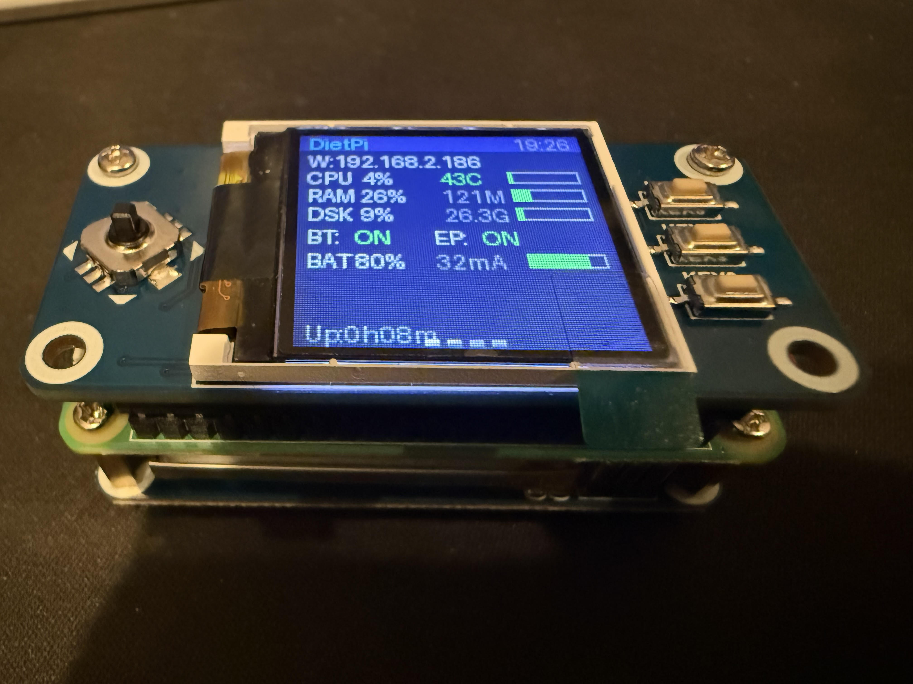

# Portable Radio Gateway Endpoint — Hardware Build Guide

A battery-powered, WiFi-connected radio endpoint built around a Raspberry Pi Zero 2W. Connects to the radio gateway over WiFi, bridges Bluetooth audio to/from a Kenwood TH-D75 handheld radio, and displays live system status on a 1.44" LCD.



## Parts List

| Part | Model | Notes |
|------|-------|-------|
| **Computer** | Raspberry Pi Zero 2 W | BCM2710A1 quad-core 1GHz, 512MB RAM, WiFi + BT 4.2 (shared BCM43436 radio) |
| **Display HAT** | Waveshare 1.44" LCD HAT (SKU: WAV-19739) | 128x128 ST7735S SPI, 3 buttons + 5-way joystick, mounts directly on GPIO header |
| **Battery HAT** | Waveshare UPS HAT (C) | 1000mAh LiPo, INA219 battery monitor (I2C 0x43), USB-C charging, ~2hr runtime |
| **Radio** | Kenwood TH-D75 | Dual-band VHF/UHF handheld, Bluetooth SPP + SCO audio, CAT control |
| **SD Card** | Any 32GB+ microSD | DietPi OS, read-only root for SD card longevity |
| **Standoffs** | M2.5 brass standoffs | 11mm for stacking Pi + display + battery HATs |

## Physical Assembly

The three boards stack vertically with standoffs:

```
┌─────────────────────────┐
│  Waveshare 1.44" LCD    │  ← Top: display + buttons
│  (SPI + GPIO header)    │
├─────────────────────────┤
│  Raspberry Pi Zero 2 W  │  ← Middle: compute
│  (GPIO header down)     │
├─────────────────────────┤
│  Waveshare UPS HAT (C)  │  ← Bottom: battery + power
│  (pogo pin connection)  │
└─────────────────────────┘
```

- The LCD HAT plugs into the Pi's 40-pin GPIO header
- The UPS HAT connects via pogo pins (spring contacts) — no soldering required
- USB-C on the UPS HAT for charging (can run while charging)

## Pin Usage

### SPI Display (ST7735S)
| Signal | GPIO | Pin |
|--------|------|-----|
| DIN (MOSI) | GPIO 10 | 19 |
| CLK (SCLK) | GPIO 11 | 23 |
| CS (CE0) | GPIO 8 | 24 |
| DC | GPIO 25 | 22 |
| RST | GPIO 27 | 13 |
| BL (Backlight) | GPIO 18 | 12 |

### Display Buttons (active low, active = pressed)
| Button | GPIO |
|--------|------|
| KEY1 | 21 |
| KEY2 | 20 |
| KEY3 | 16 |
| Joystick UP | 6 |
| Joystick DOWN | 19 |
| Joystick LEFT | 5 |
| Joystick RIGHT | 26 |
| Joystick PRESS | 13 |

### Battery Monitor (INA219)
| Signal | Pin |
|--------|-----|
| SDA | GPIO 2 (pin 3) |
| SCL | GPIO 3 (pin 5) |
| I2C Address | 0x43 |

### Bluetooth (internal BCM43436)
| Connection | Protocol |
|------------|----------|
| D75 CAT control | RFCOMM channel 2 (SPP) |
| D75 audio HSP | RFCOMM channel 1 + SCO |
| D75 MAC | 90:CE:B8:D6:55:0A |

## Software Stack

### Operating System
- **DietPi** (Debian 13 Trixie, aarch64)
- **Kernel**: 6.12.75+rpt-rpi-v8 (Raspberry Pi)
- **Root filesystem**: read-only (ext4 with `ro` in cmdline.txt)
- **Writable tmpfs**: /tmp, /var/log, /var/tmp, /var/lib/dhcp, /var/lib/bluetooth, ~/link/run

### Key Packages
- `python3` (3.13), `python3-pyaudio`, `python3-numpy`
- `pipewire`, `wireplumber` (audio routing)
- `bluetooth`, `bluez`, `bluez-firmware` (BCM43430A1.hcd required)
- `python3-hid`, `libhidapi-hidraw0` (AIOC PTT — if AIOC connected)
- `rclone` (Google Drive tunnel URL discovery)
- `pi-ina219` (battery monitoring via pip)
- `st7735`, `gpiodevice`, `gpiod` (display via pip)
- `i2c-tools` (diagnostics)

### Services (systemd)

#### System services
| Service | Purpose |
|---------|---------|
| `bluetooth` | BlueZ daemon |
| `bt-wifi-coex` | Loads rfcomm, sets noscan + txpower 15dBm |
| `deploy-endpoint` | Copies code to tmpfs, restores BT state, writes resolv.conf |
| `deploy-rclone` | Copies rclone.conf to tmpfs |
| `dropbear` | Lightweight SSH server |

#### User services (user@1001)
| Service | Purpose |
|---------|---------|
| `link-endpoint` | Radio gateway link client (D75 BT audio + CAT) |
| `pi-display` | Status display (4 pages, buttons, battery) |
| `pipewire` + `wireplumber` | Audio subsystem |

#### Disabled services
bluealsa, mpris-proxy, filter-chain, serial-getty@ttyS0, dietpi-ramlog, fake-hwclock-save, apt-daily, cron

### Display Pages

1. **Status** — hostname, IP, CPU/temp, RAM, disk, BT/EP status, battery %, uptime
2. **Network** — SSID, signal, WiFi/Eth IPs, live Rx/Tx rates, traffic totals
3. **D75 Radio** — BT state, discoverable, serial connection, model, frequencies
4. **Audio** — endpoint status, read/send/slow counts, link connection type

### Button Functions

| Button | Action |
|--------|--------|
| KEY1 | Restart endpoint service |
| KEY2 | Toggle BT discoverable (for pairing) |
| KEY3 | Toggle backlight on/off |
| Joystick UP/DOWN/LEFT/RIGHT | Cycle display pages |
| Joystick PRESS (short) | Force display refresh |
| Joystick PRESS (hold 3s) | Shutdown Pi (any button cancels) |

## Bluetooth Notes

### BT/WiFi Coexistence (BCM43436 shared radio)
The Pi Zero 2W has a single Broadcom BCM43436 chip handling both WiFi and Bluetooth via TDMA (time-division). Optimizations applied:
- `hciconfig hci0 noscan` — disable BT page scanning when not pairing
- `iw dev wlan0 set txpower fixed 1500` — reduce WiFi TX power to 15dBm (shorter bursts = more BT airtime)
- Persistent via `bt-wifi-coex.service` (runs at boot before bluetooth.service)

### SCO-over-HCI
The BCM43430 routes SCO audio to PCM pins by default. A vendor command must be sent **before every SCO connection** to route audio over HCI instead:
```
sudo hcitool cmd 0x3f 0x1c 0x01 0x02 0x00 0x00 0x00
```
This is done automatically in `remote_bt_proxy.py` AudioManager.connect().

### Pairing the D75
1. Run `sudo hciconfig hci0 piscan` on the Pi
2. Set device class: `sudo hciconfig hci0 class 0x1c0104`
3. Register SPP: `sudo sdptool add --channel=1 SP` (requires `--compat` in bluetoothd)
4. On the D75: search for "d75-pi" and pair
5. On the Pi: `sudo bluetoothctl trust 90:CE:B8:D6:55:0A`
6. Restore noscan: `sudo hciconfig hci0 noscan`

## Network Configuration

- **WiFi**: Static IP 192.168.2.186 via `/etc/network/interfaces`
- **DNS**: Pi-hole at 192.168.2.140 (resolv.conf symlinked to /tmp, populated at boot)
- **Gateway**: 192.168.2.1
- **WiFi MAC**: 88:a2:9e:82:14:99 (set DHCP reservation on router)
- **Power save**: disabled via `iw` and NetworkManager config

## Self-Update Mechanism

On startup and every reconnect (throttled to 5 min), the endpoint checks the gateway's `/api/endpoint/version` API. If new code is available:
1. Downloads updated files to tmpfs (`~/link/run/`)
2. Remounts root rw briefly
3. Persists updated files to `~/link/` (survives reboot)
4. Remounts root ro
5. Restarts via `os.execv`

## Power Consumption

| State | Current | Runtime (1000mAh) |
|-------|---------|-------------------|
| Idle (WiFi + BT + display) | ~32mA | ~31 hours |
| Active audio streaming | ~80-120mA | ~8-12 hours |
| Display backlight off | saves ~5mA | — |
| Shutdown (halted) | ~5mA (UPS quiescent) | — |

## File Layout on SD Card

```
/home/user/link/              ← Persistent code (ro root)
├── gateway_link.py
├── link_endpoint.py
├── d75_link_plugin.py
├── remote_bt_proxy.py
├── pi_status_display.py
├── rclone.conf
├── settings.json
├── dropbear_keys/            ← SSH host keys backup
│   └── dropbear_*_host_key
└── bt_state/                 ← BT pairing info backup
    └── B8:27:EB:90:A6:AD/

/home/user/link/run/          ← tmpfs working copy (ephemeral)
├── (same .py files copied at boot)
└── (updated files written by self-update)
```
